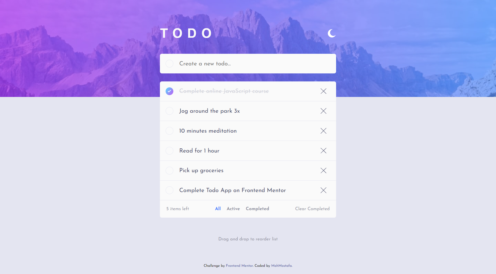
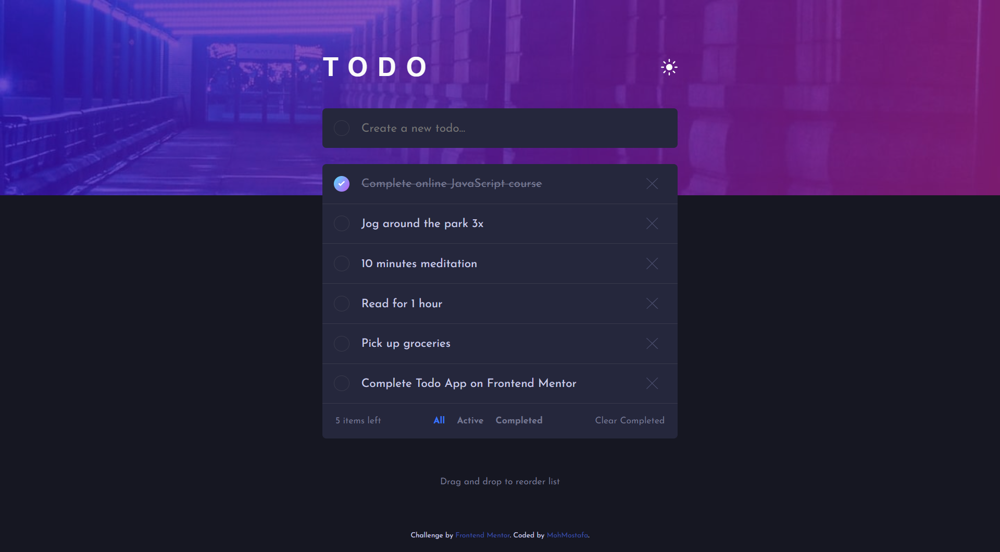
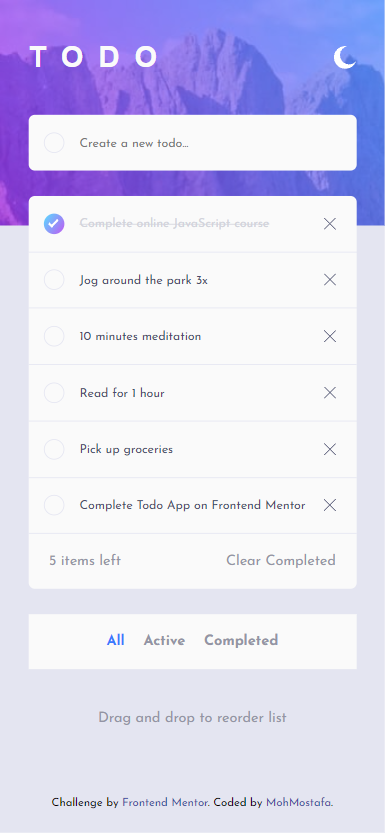
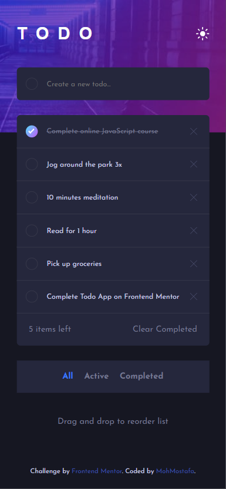

# Frontend Mentor - Todo app solution

This is a solution to the [Todo app challenge on Frontend Mentor](https://www.frontendmentor.io/challenges/todo-app-Su1_KokOW). Frontend Mentor challenges help you improve your coding skills by building realistic projects.

## Table of contents

- [Overview](#overview)
  - [The challenge](#the-challenge)
  - [Screenshot](#screenshot)
  - [Links](#links)
- [My process](#my-process)
  - [Built with](#built-with)
  - [What I learned](#what-i-learned)
  - [Useful resources](#useful-resources)
- [Author](#author)

## Overview

### The challenge

Users should be able to:

- View the optimal layout for the app depending on their device's screen size
- See hover states for all interactive elements on the page
- Add new todos to the list
- Mark todos as complete
- Delete todos from the list
- Filter by all/active/complete todos
- Clear all completed todos
- Toggle light and dark mode
- **Bonus**: Drag and drop to reorder items on the list

### Screenshot






### Links

- Solution URL: [Todo App Solution](https://github.com/MohMostafa-Web/react-todo-app-frontendmentor)
- Live Site URL: [Todo App Live Site](https://react-todo-app-frontendmentor.netlify.app/)

## My process

### Built with

- Semantic HTML5 markup [header, section]
- CSS custom properties [CSS varaibles, Media Queries]
- Flexbox
- Reactjs

### What I learned

- Use Events: "dragstart", "dragover", "drop" to reorder items.

```jsx
/* Create function to handle dragStart */
const handleDragStart = (e, i) => {
  // console.log(e.target.textContent); // debug
  draggedItemIndex.current = i; // Save index of dragged item in useRef Variable "draggedItemIndex"
  e.dataTransfer.effectAllowed = "move"; // Make drag effect "move"
};

/* Create function to handle dragOver */
const handleDragOver = (e, i) => {
  e.preventDefault(); // to allow drop elements in others
  e.dataTransfer.dropEffect = "move"; // Make drop effect "move"
};

/* Create function to handle drop */
const handleDrop = (e, i) => {
  // console.log(e.currentTarget.textContent); // debug
  dropTargetItemIndex.current = i; // Save index of dropTarget item in useRef Variable "dropTargetItemIndex"

  const copyList = [...list]; // Make a copy of list
  const draggedItem = copyList[draggedItemIndex.current]; // Get value of dragged Item, and save in variable "draggedItem"
  // console.log(draggedItem); // debug

  copyList.splice(draggedItemIndex.current, 1); // remove value of dragged Item from old index
  copyList.splice(dropTargetItemIndex.current, 0, draggedItem); // add value of dragged Item in new index

  /* Empty index variables */
  draggedItemIndex.current = null;
  dropTargetItemIndex.current = null;

  setList(copyList); // update list
};

/* JSX Elements */
<>
  {list.length !== 0 &&
    list.map((todo, index) => {
      const { id, status, title } = todo;

      return (
        // Single Todo
        <li
          key={id}
          id={id}
          className={`todo ${status} ${
            filter !== "all" && filter !== status && "hidden"
          }`}
          draggable
          onDragStart={(e) => handleDragStart(e, index)}
          onDragOver={(e) => handleDragOver(e, index)}
          onDrop={(e) => handleDrop(e, index)}
        >
          <span className="icon" onClick={() => handleMark(status, id)}>
            
          </span>
          <p onClick={handleMark} draggable="false">
            {title}
          </p>
           removeTodo(id)}
          />
        </li>
      );
    })}
</>;
```

### Useful resources

- [w3school](https://www.w3schools.com/html/html5_draganddrop.asp) - This helped me to use Events "dragstart", "dragover", "drop".
- [MDN Web docs](https://developer.mozilla.org/en-US/docs/Web/API/HTML_Drag_and_Drop_API) - This also helped me so much to understand Events "dragstart", "dragover", "drop".
- [stackoverflow](https://stackoverflow.com/questions/47811676/ondrop-event-target-is-children-when-dropped-over-children-even-when-capture-ph) - This helped for making sure a parent element is the target of a drop event, not its children.

## Author

- Linkedin - [Mohamed Mostafa](https://www.linkedin.com/in/moh-mostafa/)
- Frontend Mentor - [@MohMostafa-Web](https://www.frontendmentor.io/profile/MohMostafa-Web)
- Github - [@MohMostafa-Web](https://github.com/MohMostafa-Web)

# Getting Started with Create React App

This project was bootstrapped with [Create React App](https://github.com/facebook/create-react-app).

## Available Scripts

In the project directory, you can run:

### `npm start`

Runs the app in the development mode.\
Open [http://localhost:3000](http://localhost:3000) to view it in your browser.

The page will reload when you make changes.\
You may also see any lint errors in the console.

### `npm test`

Launches the test runner in the interactive watch mode.\
See the section about [running tests](https://facebook.github.io/create-react-app/docs/running-tests) for more information.

### `npm run build`

Builds the app for production to the `build` folder.\
It correctly bundles React in production mode and optimizes the build for the best performance.

The build is minified and the filenames include the hashes.\
Your app is ready to be deployed!

See the section about [deployment](https://facebook.github.io/create-react-app/docs/deployment) for more information.

### `npm run eject`

**Note: this is a one-way operation. Once you `eject`, you can't go back!**

If you aren't satisfied with the build tool and configuration choices, you can `eject` at any time. This command will remove the single build dependency from your project.

Instead, it will copy all the configuration files and the transitive dependencies (webpack, Babel, ESLint, etc) right into your project so you have full control over them. All of the commands except `eject` will still work, but they will point to the copied scripts so you can tweak them. At this point you're on your own.

You don't have to ever use `eject`. The curated feature set is suitable for small and middle deployments, and you shouldn't feel obligated to use this feature. However we understand that this tool wouldn't be useful if you couldn't customize it when you are ready for it.

## Learn More

You can learn more in the [Create React App documentation](https://facebook.github.io/create-react-app/docs/getting-started).

To learn React, check out the [React documentation](https://reactjs.org/).

### Code Splitting

This section has moved here: [https://facebook.github.io/create-react-app/docs/code-splitting](https://facebook.github.io/create-react-app/docs/code-splitting)

### Analyzing the Bundle Size

This section has moved here: [https://facebook.github.io/create-react-app/docs/analyzing-the-bundle-size](https://facebook.github.io/create-react-app/docs/analyzing-the-bundle-size)

### Making a Progressive Web App

This section has moved here: [https://facebook.github.io/create-react-app/docs/making-a-progressive-web-app](https://facebook.github.io/create-react-app/docs/making-a-progressive-web-app)

### Advanced Configuration

This section has moved here: [https://facebook.github.io/create-react-app/docs/advanced-configuration](https://facebook.github.io/create-react-app/docs/advanced-configuration)

### Deployment

This section has moved here: [https://facebook.github.io/create-react-app/docs/deployment](https://facebook.github.io/create-react-app/docs/deployment)

### `npm run build` fails to minify

This section has moved here: [https://facebook.github.io/create-react-app/docs/troubleshooting#npm-run-build-fails-to-minify](https://facebook.github.io/create-react-app/docs/troubleshooting#npm-run-build-fails-to-minify)
